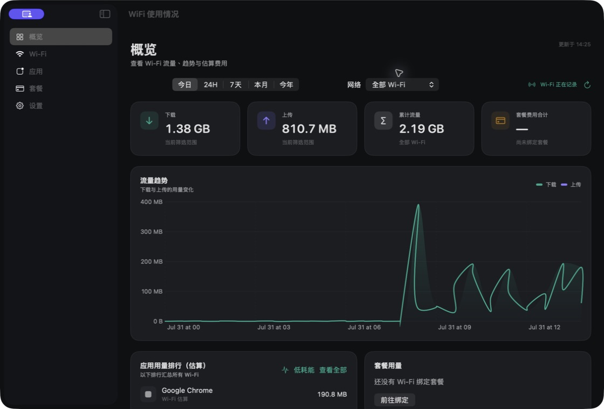

<p align="center">
  
</p>

<h1 align="center">流量账本 · WiFiUsage</h1>

<p align="center">
  一款本地优先的 macOS Wi‑Fi 流量统计工具。<br>
  按不同 Wi‑Fi 分开记录用量、绑定套餐并估算费用。
</p>

<p align="center">
  
  
  
  
</p>



## 主要功能

- 通过物理 Wi‑Fi 网卡累计计数记录下载、上传和总用量。
- 自动识别当前 Wi‑Fi，在网络切换后建立独立用量分组。
- 为不同 Wi‑Fi 分别绑定计费套餐。
- 支持基础费用、上下行额度和超额单价。
- 同一个套餐可以供多个 Wi‑Fi 共用额度。
- 支持人民币、美元、欧元、日元和港币。
- 查看今日、24 小时、7 天、本月和今年的流量趋势。
- 通过 macOS 自带的 `nettop` 在本机估算各应用的 Wi‑Fi 用量。
- 提供低耗能和临时精细统计两种应用统计模式。
- 通过菜单栏快速查看当前用量和估算费用。
- 支持登录时自动启动。
- 在本机保留最近 7 天、合计最多 5 MiB 的脱敏诊断日志，可随时查看或清除。
- 支持应用内反馈；日志不会自动上传，联系方式和脱敏诊断日志均须分别明确选择才会发送。
- 不注册账号、不安装驱动，流量、套餐和设置数据均保存在本机。

## 下载与安装

可从官网下载适用于 Apple Silicon 和 Intel Mac 的 Universal DMG：

- [下载流量账本 1.1.0（build 2）](https://xjp.one/wifiusage/downloads/WiFiUsage-1.1.0-free.dmg)
- [打开产品官网](https://xjp.one/wifiusage/)

安装步骤：

1. 打开 DMG，将 `WiFiUsage.app` 拖入“应用程序”。
2. 当前版本尚未经过 Apple 公证。首次启动请在“应用程序”中右键 `WiFiUsage.app`，选择“打开”；若仍被阻止，再到“系统设置”→“隐私与安全性”点“仍要打开”。
3. 首次运行后，在应用设置中允许识别当前 Wi‑Fi 名称。

发布文件：

```text
WiFiUsage-1.1.0-free.dmg
SHA-256: aad32b364b5418948b34570adf1fd6cfadd874a740eb6d0b53d8aa2a0ab031b5
```

也可以前往 [Releases](https://github.com/mx3353672833-debug/WiFiUsage/releases) 获取安装包与源码，或克隆仓库自行构建：

```sh
git clone https://github.com/mx3353672833-debug/WiFiUsage.git
cd WiFiUsage
```

系统要求：

- macOS 14 或更高版本
- Apple Silicon Mac 或 Intel Mac

## 第一次使用

1. 打开应用，确认首页显示“正在记录”。公共免费版会直接识别当前 Wi‑Fi，无需授予定位权限。
2. 进入“Wi‑Fi”页面，确认当前网络已经显示。
3. 进入“套餐”页面，添加套餐并选择需要绑定的 Wi‑Fi。
4. 如需减少应用未运行期间的统计缺口，可在设置中开启“登录时启动”。

公共免费版通过 macOS 本机网络信息识别当前 Wi‑Fi，不申请定位权限。流量账本不会读取、保存或上传地理位置。

## 数据与隐私

- 不需要注册账号。
- 不需要管理员权限。
- 不安装驱动、Network Extension 或 System Extension。
- 不包含自动遥测、广告或云端同步。
- 流量、套餐和设置均保存在本机。
- 脱敏诊断日志保存在本机，保留最近 7 天，合计最多占用 5 MiB；不会在后台自动上传。
- 默认保留最近 400 天的统计记录。

只有在你主动发送应用内反馈时，问题描述、问题类型、软件版本与 build、macOS 版本和处理器架构才会通过加密连接发送。联系方式与脱敏诊断日志是两个独立选项，只有分别明确选择后才会随反馈发送。发送前可以预览日志；日志包含功能状态和错误代码，不包含 Wi-Fi 名称、应用名称、文件路径、流量记录、套餐内容或联系方式。

本地数据库位于：

```text
~/Library/Application Support/WiFiUsage/usage.sqlite
```

本地诊断日志位于：

```text
~/Library/Application Support/WiFiUsage/Logs/
```

请不要在公开 Issue 中上传自己的 `usage.sqlite` 数据库或未经检查的诊断日志。

## 统计口径与已知限制

Wi‑Fi 总用量来自物理网卡累计计数，应用用量来自 macOS `nettop` 的本地估算。

| 项目 | 统计方式 | 适合用途 |
| --- | --- | --- |
| Wi‑Fi 总用量 | 物理网卡累计计数 | 按网络查看上下行用量、估算套餐费用 |
| 应用用量 | `nettop` 进程快照差分 | 观察应用联网趋势和费用占比 |

使用时请注意：

- 仅能记录流量账本运行期间产生的流量。
- 同名 SSID 会被视为同一个 Wi‑Fi。
- 旧记录如果没有保存 Wi‑Fi 名称，会显示为“未识别的历史用量”。
- 极短连接、系统服务、VPN 和代理可能无法完整归属到具体应用。
- 应用排行目前不能按 Wi‑Fi 名称拆分，显示的是全部 Wi‑Fi 的综合估算。
- 多币种套餐不会自动进行汇率换算。
- 套餐费用仅供参考，不应替代运营商账单或审计数据。

### 低耗能

适合全天后台运行。它使用低频累计快照计算应用流量，对处理器和电量的影响更小，但可能漏记非常短暂的连接。

### 精细统计（5 分钟）

临时提高统计频率，可覆盖更多短连接，但会增加处理器占用和耗电。运行 5 分钟后会自动恢复低耗能模式。

## 从源码构建

需要：

- macOS 14+
- Xcode
- Swift 6
- [XcodeGen](https://github.com/yonaskolb/XcodeGen) 2.45.4+

生成工程：

```sh
xcodegen generate
```

打开工程：

```sh
open WiFiUsage.xcodeproj
```

运行核心测试：

```sh
xcodebuild \
  -project WiFiUsage.xcodeproj \
  -scheme UsageCoreTests \
  -destination 'platform=macOS' \
  CODE_SIGNING_ALLOWED=NO \
  test
```

只检查 Release 是否可以编译：

```sh
xcodebuild \
  -project WiFiUsage.xcodeproj \
  -scheme WiFiUsage \
  -configuration Release \
  CODE_SIGNING_ALLOWED=NO \
  build
```

公共发布 DMG 尚未经过 Apple 公证。首次启动请在“应用程序”中右键 `WiFiUsage.app` 并选择“打开”；若仍被阻止，再到“系统设置”→“隐私与安全性”点“仍要打开”。

## 项目结构

- `WiFiUsage`：macOS 主应用和菜单栏界面
- `UsageCore`：流量模型、套餐计费、SQLite 存储和数据聚合
- `SystemBridge`：物理网卡与进程信息桥接
- `UsageCoreTests`：核心逻辑测试

## 反馈问题

可以在应用的“设置”→“诊断与反馈”中直接报告问题。应用内每次反馈都会发送软件版本与 build、macOS 版本和处理器架构；联系方式和脱敏诊断日志均为独立选项，不会默认附带。选择附带日志后，可以在发送前预览具体内容。

也欢迎通过 [Issues](https://github.com/mx3353672833-debug/WiFiUsage/issues) 报告问题。公开提交时请提供：

- macOS 版本
- Mac 处理器类型
- 复现步骤
- 已隐藏 Wi‑Fi 名称和个人信息的截图

## 使用与授权

当前仓库公开源代码，但尚未附加开源许可证。在获得明确授权之前，请不要复制、修改或重新分发。
